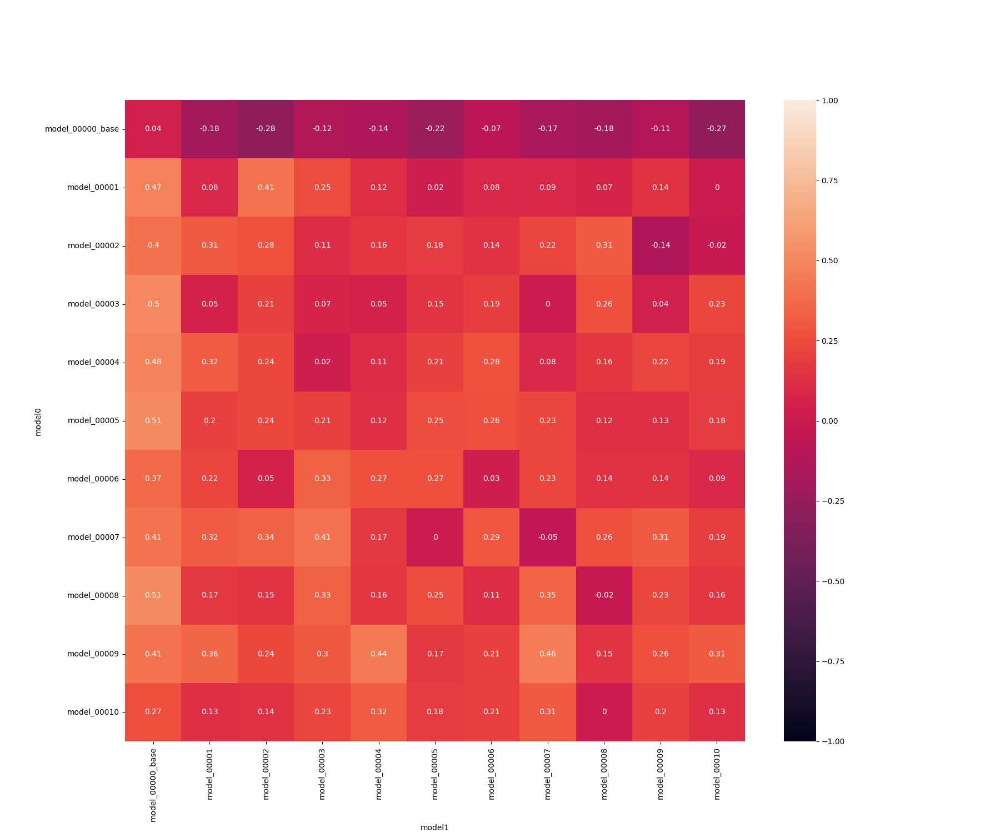
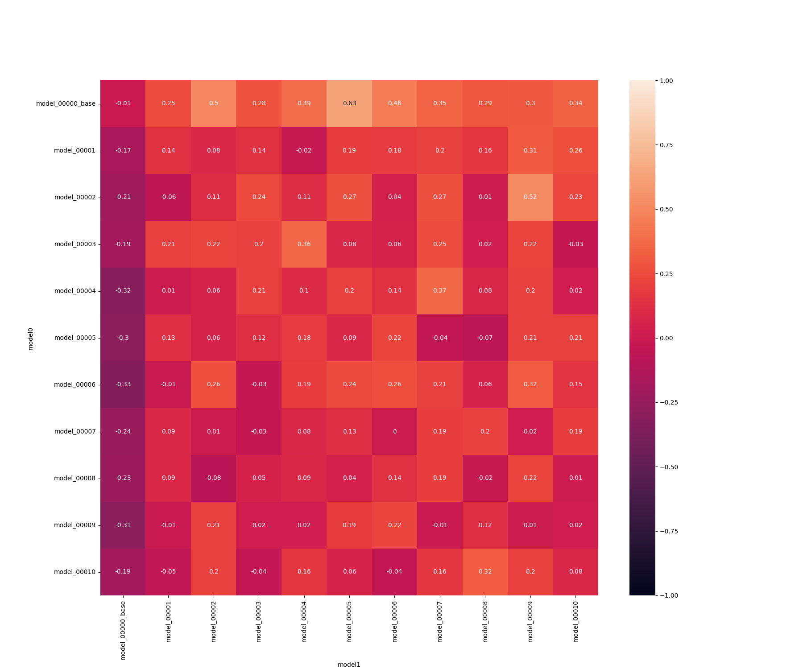
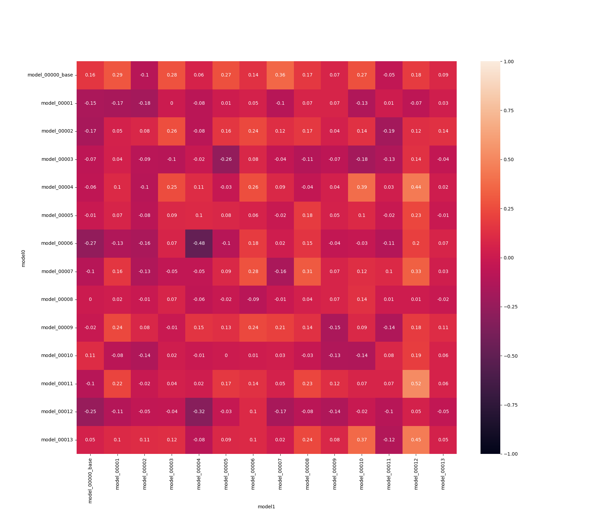
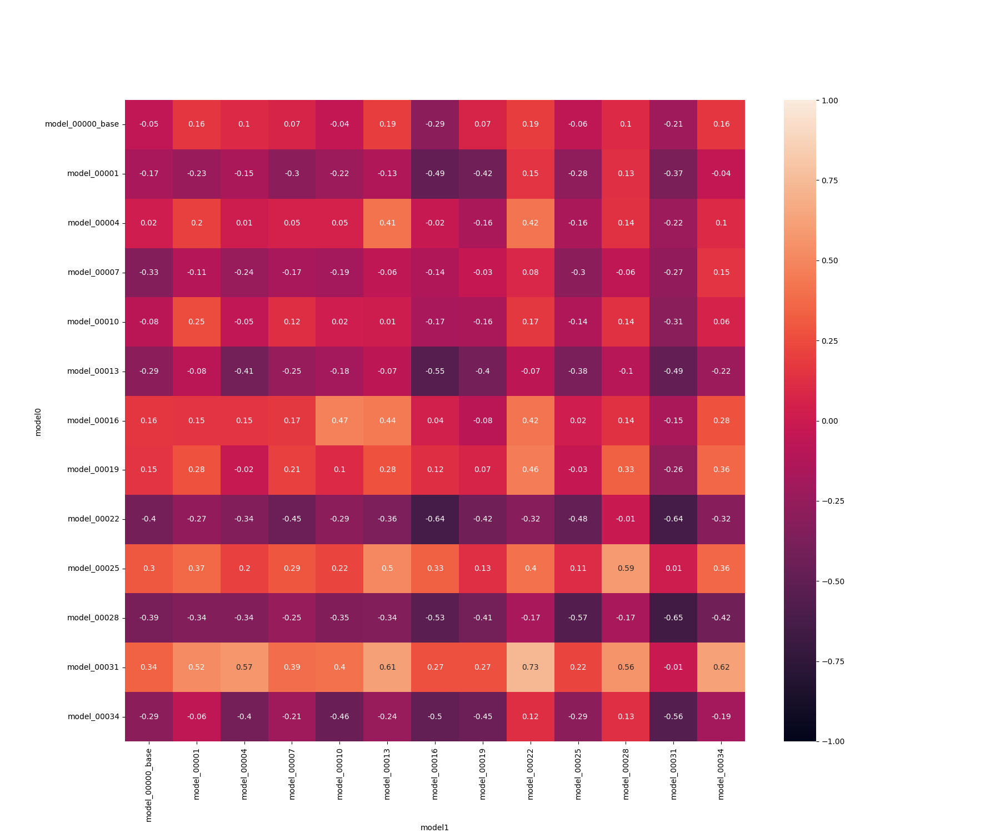
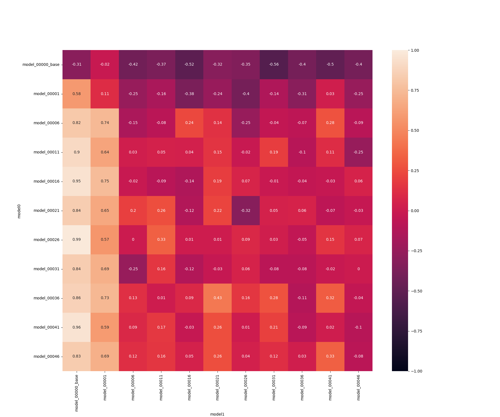
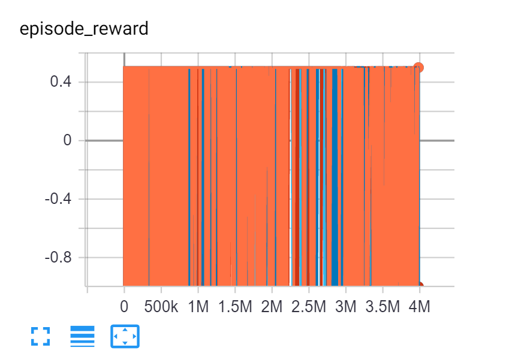
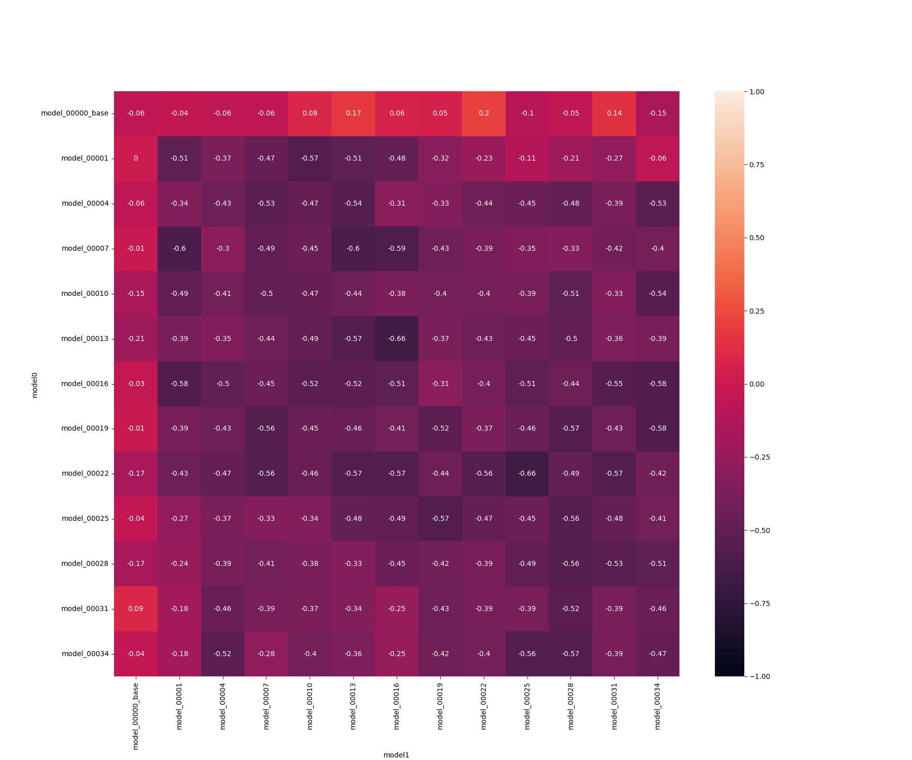
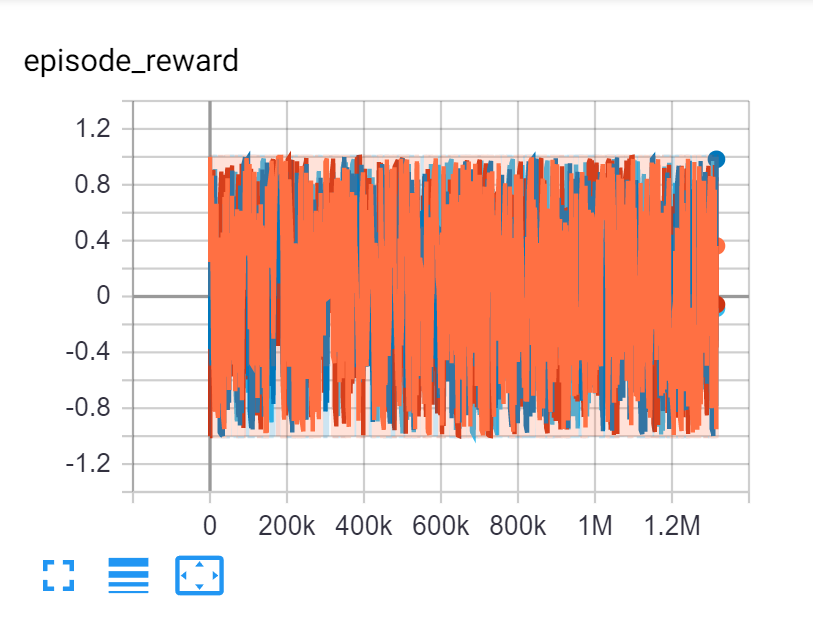

# Teal and pink experiments Feb 2022

The repository setup with a full implementation of the teal and pink cards from Go Nuts With Donuts. The card distribution was from the vanilla game (so few pink cards).
I also note that I made a mistake with the CF implementation - the non-chosen card is not returned to the deck, but I can't see this affecting the model.

The model architecture was set up with a full 5-player, all-cards observation space, including sight of all discards, and 70 (pick) and 70 (discard) actions.

ACTIONS = 140 # 2x number of card (ids) - 70 for the 5-player game
FEATURE_SIZE = 635

(for reference, in the previous experiments it was a specialised 3-player game space of:
ACTIONS = 39
FEATURE_SIZE = 64
)

## Training run 1

5 hr training (at that point the trainer crashed with no logs, probably not a GNFD business logic issue).

10 models created [model zoo](./../app/viz/teal_and_pink_20220223)

Tournament, 50 games, modelX vs modelY vs base `docker-compose exec app python3 tournament.py -st 0 -sp 11 -d -g 50 -e gonutsfordonut`

### Results
[results file](./../app/viz/tournament_results_teal_and_pink_50.csv)

Showing players 1 (rows) and 2 (columns) with player 1 score (player 3, always base is hidden)


Showing players 1 (rows) and 2 (columns) with player 2 score (player 3, always base is hidden)


Note that player 3 (base) always scores badly, so takes a lot of the minus weights. However, we still see a trend to the bottom-left corner (player 1 scores) or top-right corner (player 2 scores)
showing that the models are improving and don't appear to have saturated.

Playing against model 10 it had clearly not trained fully (identical cards had very different weights > 0.1) but it played at a decent level. I wasn't able to judge
it's play on the difficult pink cards.

In terms of absolute performance, the models are getting roughly 0.5 against 2x base models.
In contrast, the previous teal-only models got > 0.8 and I'd expect it to be harder for random play (base) to achieve such good results in the more complex teal-and-pink scenario. Note that the previous teal models achieved this performance after 2 generations (5 min of training) so training speed with this setup is vastly worse.

## Training run 2 - b113d6e

Try training a model using the same action / observation space only with teal cards and see how it does against the teal/pink trained models.

In the last experiment in Dec, a teal-only model trained very fast, but this is using the full 5-player all-cards obs/action space so may? train slower.

This trained a lot slower, after about 12 hrs, it had only produced 13 models.

13 models created [model zoo](./../app/viz/teal_only_20220223)

Running a tournament just with these 13 models against each other to see if they have reached saturation (like the previous teal only trials)



Unclear why training here has been even less successful.

None of these models seem significantly better than base, so not worth proceeding further.

## Training run 3 - 236b9e5

To see if we can restore fast training, using the teal only cards and hacking the obs/action spaces down to:

ACTIONS = 70
FEATURE_SIZE = 353

by dropping the RV action, reducing to 3 players and dropping the full visibility of the discard deck.

This trained 34 models after in excess of 6 hrs, but performance seemed no better than noise.



I'm not quite sure why this performed SO badly, but it encourages me to make the model just as tiny as possible.

## Training run 4 - 079da56

Reverted to the original teal-only codebase to check I could replicate the results and it wasn't a fluke.



The model performed far better (again) than any recent experiment.

Trainin

```
-rw-r--r-- 1 flend flend 140927 Mar  1 07:08 _model_00001_0_0.59_36864_.zip
-rw-r--r-- 1 flend flend 140927 Mar  1 07:11 _model_00002_0_0.522_77824_.zip
-rw-r--r-- 1 flend flend 140927 Mar  1 07:19 _model_00003_0_0.265_159744_.zip
-rw-r--r-- 1 flend flend 140927 Mar  1 07:35 _model_00004_0_0.236_282624_.zip
-rw-r--r-- 1 flend flend 140927 Mar  1 07:46 _model_00005_0_0.29_364544_.zip
-rw-r--r-- 1 flend flend 140927 Mar  1 07:50 _model_00006_0_0.248_405504_.zip
-rw-r--r-- 1 flend flend 140927 Mar  1 08:09 _model_00007_0_0.202_569344_.zip
-rw-r--r-- 1 flend flend 140927 Mar  1 08:14 _model_00008_0_0.215_610304_.zip
-rw-r--r-- 1 flend flend 140927 Mar  1 14:12 _model_00009_0_0.221_3600384_.zip
-rw-r--r-- 1 flend flend 140927 Mar  1 15:28 _model_00010_0_0.269_4214784_.zip
-rw-r--r-- 1 flend flend 140927 Mar  1 15:33 _model_00011_0_0.261_4255744_.zip
-rw-r--r-- 1 flend flend 140927 Mar  1 16:47 _model_00012_0_0.209_4911104_.zip
-rw-r--r-- 1 flend flend 140927 Mar  2 07:56 _model_00013_0_0.212_16297984_.zip
-rw-r--r-- 1 flend flend 140927 Mar  2 08:08 _model_00014_0_0.236_16502784_.zip
-rw-r--r-- 1 flend flend 140927 Mar  2 08:17 _model_00015_0_0.212_16666624_.zip
-rw-r--r-- 1 flend flend 140927 Mar  2 08:31 _model_00016_0_0.201_16912384_.zip
-rw-r--r-- 1 flend flend 140927 Mar  2 08:55 _model_00017_0_0.246_17321984_.zip
-rw-r--r-- 1 flend flend 140927 Mar  2 09:23 _model_00018_0_0.222_17813504_.zip
-rw-r--r-- 1 flend flend 140927 Mar  2 09:27 _model_00019_0_0.232_17895424_.zip
-rw-r--r-- 1 flend flend 140927 Mar  2 09:39 _model_00020_0_0.218_18100224_.zip
-rw-r--r-- 1 flend flend 140927 Mar  2 09:53 _model_00021_0_0.203_18345984_.zip
-rw-r--r-- 1 flend flend 140927 Mar  2 10:00 _model_00022_0_0.211_18468864_.zip
-rw-r--r-- 1 flend flend 140927 Mar  2 11:14 _model_00023_0_0.206_19779584_.zip
-rw-r--r-- 1 flend flend 140927 Mar  2 12:34 _model_00024_0_0.201_21172224_.zip
-rw-r--r-- 1 flend flend 140927 Mar  2 12:43 _model_00025_0_0.221_21336064_.zip
-rw-r--r-- 1 flend flend 140927 Mar  2 12:59 _model_00026_0_0.214_21622784_.zip
-rw-r--r-- 1 flend flend 140927 Mar  2 13:34 _model_00027_0_0.212_22237184_.zip
-rw-r--r-- 1 flend flend 140927 Mar  2 13:42 _model_00028_0_0.21_22360064_.zip
-rw-r--r-- 1 flend flend 140927 Mar  2 13:46 _model_00029_0_0.202_22441984_.zip
-rw-r--r-- 1 flend flend 140927 Mar  2 18:27 _model_00030_0_0.212_27357184_.zip
-rw-r--r-- 1 flend flend 140927 Mar  2 18:32 _model_00031_0_0.202_27439104_.zip
-rw-r--r-- 1 flend flend 140927 Mar  2 18:56 _model_00032_0_0.202_27848704_.zip
-rw-r--r-- 1 flend flend 140927 Mar  2 19:01 _model_00033_0_0.201_27930624_.zip
-rw-r--r-- 1 flend flend 140927 Mar  2 19:33 _model_00034_0_0.221_28504064_.zip
-rw-r--r-- 1 flend flend 140927 Mar  2 19:45 _model_00035_0_0.245_28708864_.zip
-rw-r--r-- 1 flend flend 140927 Mar  2 19:50 _model_00036_0_0.216_28790784_.zip
-rw-r--r-- 1 flend flend 140927 Mar  2 19:55 _model_00037_0_0.217_28872704_.zip
-rw-r--r-- 1 flend flend 140927 Mar  2 20:04 _model_00038_0_0.267_29036544_.zip
-rw-r--r-- 1 flend flend 140927 Mar  2 20:16 _model_00039_0_0.245_29241344_.zip
-rw-r--r-- 1 flend flend 140927 Mar  2 20:21 _model_00040_0_0.221_29323264_.zip
-rw-r--r-- 1 flend flend 140927 Mar  2 20:49 _model_00041_0_0.22_29814784_.zip
-rw-r--r-- 1 flend flend 140927 Mar  2 20:51 _model_00042_0_0.209_29855744_.zip
-rw-r--r-- 1 flend flend 140927 Mar  3 01:31 _model_00043_0_0.239_34689024_.zip
-rw-r--r-- 1 flend flend 140927 Mar  3 01:33 _model_00044_0_0.248_34729984_.zip
-rw-r--r-- 1 flend flend 140927 Mar  3 01:40 _model_00045_0_0.226_34852864_.zip
-rw-r--r-- 1 flend flend 140927 Mar  3 01:43 _model_00046_0_0.33_34893824_.zip
-rw-r--r-- 1 flend flend 140927 Mar  3 01:47 _model_00047_0_0.212_34975744_.zip
-rw-r--r-- 1 flend flend 140927 Mar  3 01:52 _model_00048_0_0.31_35057664_.zip
-rw-r--r-- 1 flend flend 140927 Mar  3 01:55 _model_00049_0_0.244_35098624_.zip
-rw-r--r-- 1 flend flend 140927 Mar  3 02:20 _model_00050_0_0.219_35344384_.zip
-rw-r--r-- 1 flend flend 140924 Mar  1 07:05 base.zip
-rw-r--r-- 1 flend flend 140927 Mar  3 02:20 best_model.zip
```

Training speed was also fast (see above)

Performance seems to have saturated at model 6 (5 step sampling) which was after 45 min of training (4 cores).

My hypothesis is that the obvs space of 64 just works better because it's a power of 2. I'll try the teal only cards with the modern code base at 64 obvs space next to see if I can repeat this performance. Otherwise something else is different in the new code base which is killing performance.

## Training run 5 - 7d4f4ab

Returning to the types codebase, using only the first 8 card types and 3 players.

```
ACTIONS = 8
FEATURE_SIZE = 64
```

Trying an observation space of 64 to see if this will give as good results as 079da56 despite the different setup.
If it's not the obvs size I must have broken something else.

We produced 30 models here in a few hours but bizarrely they NEVER win during training (only draw):


I don't know if this happens on other runs

The tournament results are dreadful, we have created a model that consistently loses against base. I suspect there is something wrong with the use of random to pick a card when more there is more than 1 of a type.



As a comparison, here's a training run with 079da56



This runs -1 to 1 so this is a problem in 7d4f4ab. The tournament results for 7d4f4ab show that the earlier models do win occasionally against base but they never win against any models (model1 or later).


